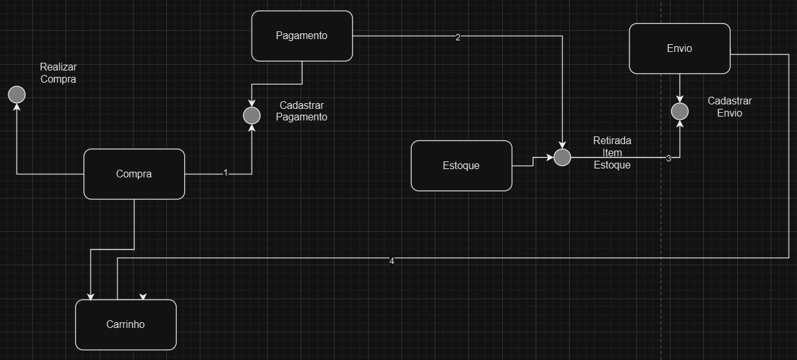
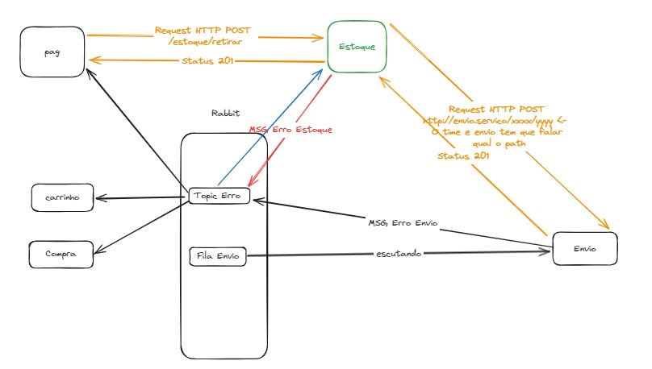

# Projeto Final do programa <Devª> da Ada Tech em parceria com a B3 - Microsserviço para Gerenciamento de Estoque


## Descrição


Projeto final do programa Devª da Ada em parceria com a B3. O Serviço de Estoque é um microsserviço projetado para gerenciar o estoque de produtos em um sistema de comércio eletrônico. Ele oferece funcionalidades para adicionar, remover e estornar itens do estoque, mantendo a integridade e a precisão dos registros de estoque em tempo real.
Este microsserviço é parte de uma arquitetura distribuída, e se comunica via REST e RabbitMQ com microsserviços de Carrinho, Compra, Pagamento, e Envio.


## Índice

- [Ferramentas Utilizadas](#ferramentas-utilizadas)
- [Pré-requisitos e Instruções de Execução](#pre-requisitos-e-instrucoes-de-execucao)
- [Fluxo de Integração dos Microsserviços](#fluxo-de-integração-dos-microsserviços)
- [Fluxo de Dados Para Requisições REST e RabbitMQ](#fluxo-de-dados-para-requisições-rest-e-rabbitmq)
- [Contribua!](#contribua)
- [Licença](#licença)
- [Desenvolvedoras](#desenvolvedoras)


## Ferramentas Utilizadas

**Back-end:**
- Java
- Spring Boot
- PostgreSQL
- OpenFeign (comunicação REST com outros microsserviços)
- RabbitMQ
  
## 💻 Pré-requisitos e Instruções de Execução

- Java versão 17 ou superior
- Conexão com o banco de dados Postgres.

1. Clone o repositório na sua máquina local: ` git clone <repository_url> `
3. Configure as URLs de Estoque e Envio no arquivo ` application `
4. Execute o projeto usando sua IDE de preferência (Ex.: IntelliJ IDEA, Eclipse).

## Fluxo de Integração dos Microsserviços


## Fluxo de Dados Para Requisições REST e RabbitMQ


### Descrição da Estrutura JSON

Aqui está a estrutura JSON para representar uma compra, incluindo informações sobre os itens comprados e detalhes de envio:

```json
{
   "id_compra":"string",
   "id_cliente":"string",
   "itens":[
      {
         "sku":"string",
         "quantidade":"string"
      }
   ],
   "envio":{
      "cep":"string",
      "rua":"string",
      "bairro":"string",
      "cidade":"string",
      "estado":"string",
      "numero":"string",
      "destinatario":"string"
   }
}
```

### Producers:
- Estoque  
Informar-Erro-Envio (tópico -Error-) 

Corpo:
  
```json
{
    "id_compra":"string",
    "error":"string"
}
```

### Consumers:
- Compra (erro ao realizar compra)
- Carrinho (Encerrar Carrinho)
- Pagamento (Mudar status pagamento)
- Estoque (Reverter itens removidos do estoque)
### Producers:
- Envio


## 📫 Contribua!

😄 Siga estes passos:

1. Faça um fork deste repositório.
2. Crie um branch: ``git checkout -b <nome_branch>``
3. Faça suas alterações e as comite: ``git commit -m '<mensagem_commit>'``
4. Faça o push para o branch original: ``git push origin <nome_do_projeto>/<local>``
5. Crie o pull request.

Alternativamente, consulte a documentação do GitHub sobre como criar um pull request.

## Licença
Este projeto está licenciado sob a Licença MIT.

## Desenvolvedoras 

- [@MelissaNP](https://github.com/MelissaNP)
- [@nataliadiotto](https://github.com/nataliadiotto)
- [@pri-kleine](https://github.com/pri-kleine)
- [@suersil](https://github.com/suersil/sistema-gerenciamento-estudantes)
- [@yelalopez](https://github.com/yelalopez/sistema-gerenciamento-estudantes)
